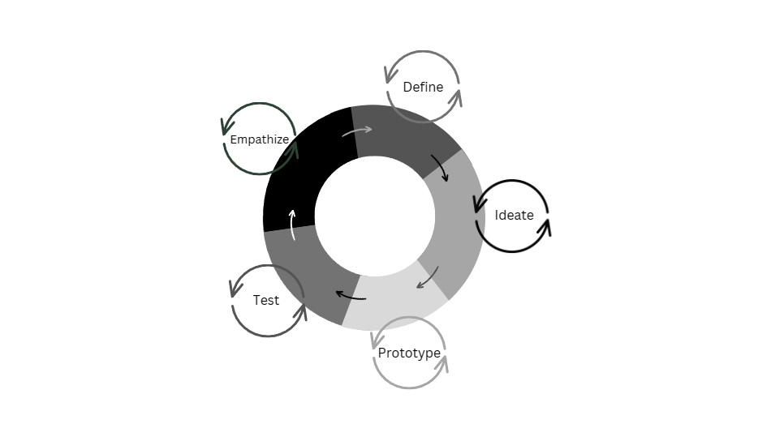
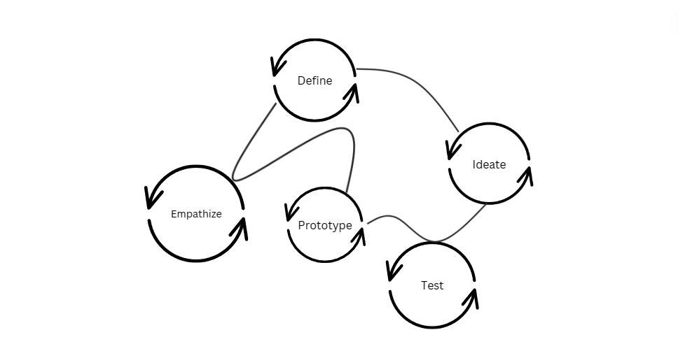

## What is Design thinking?

Design thinking is an approach to problem-solving and innovation. It is a user-centric approach which focuses on the solution. 

Design thinking has five (5) stages: Empathize, Define, Ideate, Prototype, Test
<ol>
    <li>Empathize - In this stage you try to understand the user and their needs by gathering information</li>
    <li>Define – Based on discoveries made during the empathize stage you will define the user problem</li>
    <li>Ideate – With the problem statement in mind, come up with as many ideas as possible, later in this stage, you will evaluate the ideas</li>
    <li>Prototype – create a model of the intended solution, it can be a paper version or something more complex, but you must be mindful it can be discarded</li>
    <li>Test – In this stage you will have users interact with your prototype and collect feedback for improvements and further iteration</li>
</ol>
*Design Thinking Stages*

Although the stages are generally followed in order the process may be non-linear, meaning any stage can be done at any time, it would look more like the diagram below not above. 

*Design Thinking Stages*

The process is also iterative, it may be completed then repeated or there may be iteration within the stages as well, allowing for deeper exploration.

Design Thinking vs UX Design

    
UX design is the design of products and services that provide the user with meaningful, enjoyable and seamless user experiences.
 

Design Thinking is a problem-solving framework which can be applied to any type of problem, and is particularly useful for complex problems.

Creating user experiences as described in the first paragraph above, is a problem designers face and Design Thinking is ONE framework which can be used to solve them.

Simply put UX Design is a broad field of study and practice and Design Thinking is a problem-solving approach. The one thing key thing they have in common is that they are both user-centric.

### References

Academy of Design Thinking  Design Thinking vs UX Design 
[https://www.google.com/amp/s/www.academyofdesignthinking.com/amp/design-thinking-vs-ux-design](https://www.google.com/amp/s/www.academyofdesignthinking.com/amp/design-thinking-vs-ux-design)

BrainStation What is Design Thinking 
https://brainstation.io/career-guides/what-is-design-thinking

Han, E. What is Design Thinking & Why Is IT Important? 
[https://online.hbs.edu/blog/post/what-is-design-thinking](https://online.hbs.edu/blog/post/what-is-design-thinking)

IDEO Design Thinking Defined 
[https://designthinking.ideo.com/](https://designthinking.ideo.com/)

Oppliger, T. What is Design Thinking in UX/ UI Design? 
[https://flatironschool.com/blog/what-is-design-thinking/](https://flatironschool.com/blog/what-is-design-thinking/)

Oyesiji, A. UX design vs design thinking 
[https://bootcamp.uxdesign.cc/ux-design-vs-design-thinking-8e7ce0fda8a7](https://bootcamp.uxdesign.cc/ux-design-vs-design-thinking-8e7ce0fda8a7)

Stevens, E. The Design Thinking Process: 5 Steps Complete Guide 
[https://careerfoundry.com/en/blog/ux-design/design-thinking-process/#what-is-the-design-thinking-process](https://careerfoundry.com/en/blog/ux-design/design-thinking-process/#what-is-the-design-thinking-process)

