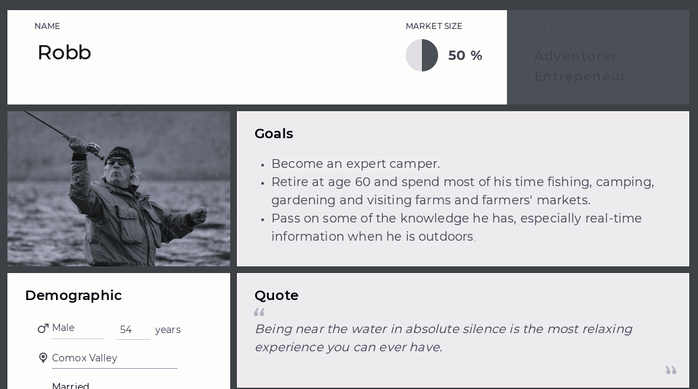
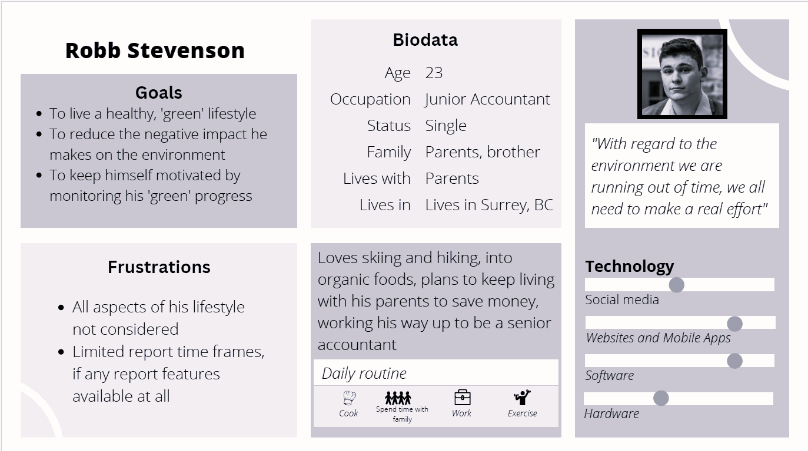

## User Personas

A user persona is a representation of your target audience that you have made up. 
The persona is fictitious but demonstrates these aspects of your real-world user:
* Name
* Picture
* Quote
* Short biography
* Background
* Needs
* Goals or objectives
* Pain points or challenges
* Behaviours
* Skills – communication, technological, or related to product
* Products used
* Demographics

### Examples of User Personas
Persona for the Comox Valley Search and Rescue. Users visit the website to:
* Learn about outdoor and adventure safety
* Learn about becoming a member of CVSR

*Part of user persona Comox Valley Search and Rescue*

Persona for Reduce. Users are:
* Younger, technologically oriented people who are environmentally conscious
* Want to find ways to track and reduce their carbon dioxide output.

*User persona Reduce app*