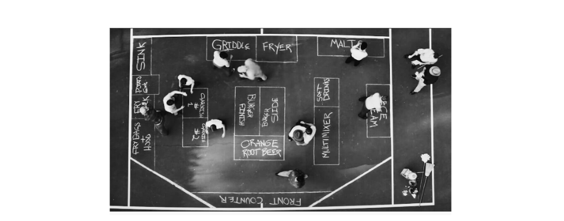

## Stage 3 - Ideate
!!! <strong>_Many novel ideas lead to innovation_</strong>
 
Keeping the problem statement developed from the previous stage at the front of your mind, come up with as many ideas as possible to solve it. It doesn’t matter how far-fetched or simple the ideas may be. Don’t overthink or think about which ones are good or bad, easy to implement, fun or unfeasible, just generate ideas.
 
Once you have generated ideas, you will narrow down your list and eventually move forward to the prototype stage with one or two ideas.
* Group very similar ideas
* Combine ideas if necessary
* Evaluate them based on available resources (time, technology skill, design skill, budget)
 
### Ideation Techniques and Tools
* Brainstorming
* Mind maps
* Sketches
* Reverse brainstorming or negative brainstorming
* Storyboards
* Brainwriting
* SCAMPER

#### Brainstorming
* Brainstorming is the go-to ideation technique. 
* It can be used individually or in a team. 
* There are many ways you can brainstorm, even utilising other techniques such as sketching and mind-maps. 
* When brainstorming try to focus on questions not just solutions and as with any form of ideation be as open-minded as possible.

#### Bodystorming
* Bodystorming is an immersive brainstorming technique. 
* It is physical and hands-on where users and/or designers engage in simulation and role play to re-create an environment where the product or service that is being developed is used. 
* It may require more planning and equipment but can be a fun approach that quickly finds problem areas and helps to resolve pain points.
*The founder of McDonald applied bodystorming with the staff, cooks, and leadership team to prototype the back-of-house space to optimize the workflow (photo credit: The Founder, see references)*

#### Mind Maps
Mind mapping is a visual ideation technique, which can be done individually or as a team, on a whiteboard or on paper. 
* Start with a central theme, it could be your problem definition
* Create branches, each branch can be a related concept, don’t worry about it being a solution
* Develop each branch further, adding on related ideas
* If sub-branches can be further divided go ahead and do so
*Mindmap Example*

#### Sketches
Sketching is another visual ideation technique quite similar to brainstorming. Participants sketch ideas individually or in a team. 
One approach for teams is to create sketches then display them or pass them around for each person to add on to them or make changes. 
An individual may make multiple sketches quickly then choose a few to refine before eventually picking one to take to completion.
*Sketches for a business card*

#### SCAMPER

SCAMPER is an ideation method that encourages divergent thinking. Users explore existing products, services or concepts, and through the application of the acronym’s activities, develop new products, services or concepts. 
For simplicity we will refer to the product, service or concept as the item.

**S**ubstitute
**C**ombine 
**A**dapt
**M**odify
**P**ut to another use
**E**liminate
**R**everse

**Substitute**

Replacing part or all the item with something else. Some of the biggest innovations involve a radical change, for example, what were radios replaced with?

**Combine**

Combine two or more features of an item or two or more items to create something new. At some point in time someone came up with the idea to combine shoes and socks!

**Adapt**

Can this item be used to solve another problem, or similarly can another solution elsewhere be moulded to solve the problem you are facing?

**Modify**

This entails changing the product in a small way, perhaps size, shape or colour to target a specific portion of your market or to resolve a particular customer pain point. An example is changing the shape of a pillow to better suit side-sleepers.

**Put to another use**

In this case, the item mainly refers to physical products. Can the item be made from materials or products that were discarded or unused? Or can the item that you are working on be used elsewhere. Common examples are products being made from recycled materials.

**Eliminate**

This entails the removal of a part of the item. For example, it can be eliminating steps in a service to provide the user with a better experience, such as removing the need for sign-up or log-in.

**Reverse**

In this technique, ideation focuses on rearranging or reversing the order or importance of steps or parts. It can result in a completely novel way of providing a service.

###### References
###### Better Brainstorming (hbr.org)
###### Brainstorming in Design Thinking - A Complete Guide (theknowledgeacademy.com)
###### 
###### From Brainstorming to Bodystorming - DesignWanted : DesignWanted
###### think.design/user-design-research/bodystorming/
###### What Is Bodystorming? Bodystorming In A Nutshell - FourWeekMBA
###### 
###### 
###### Using the 7-Step SCAMPER Technique for Great UX Design (careerfoundry.com)
###### SCAMPER - The Decision Lab
###### 