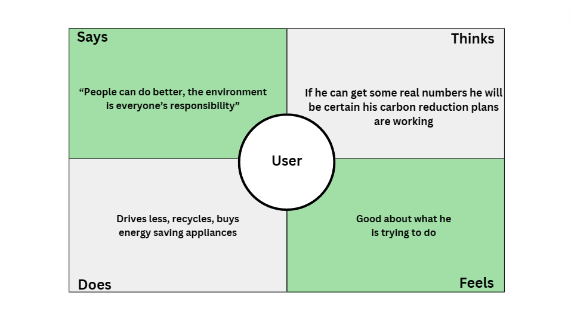
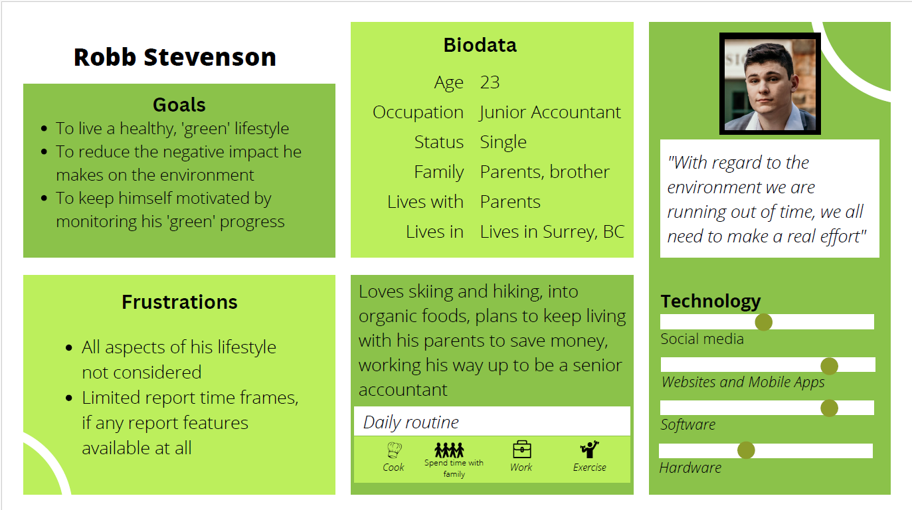
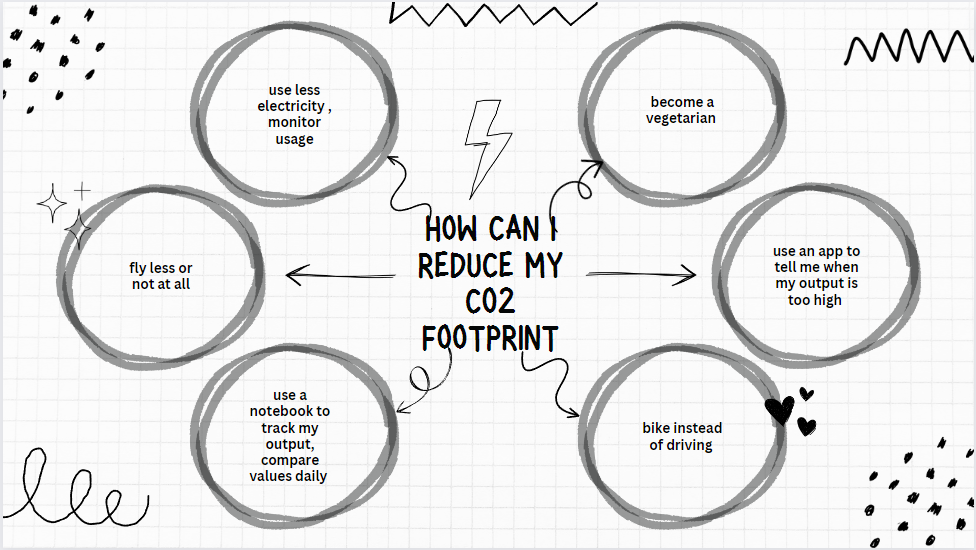
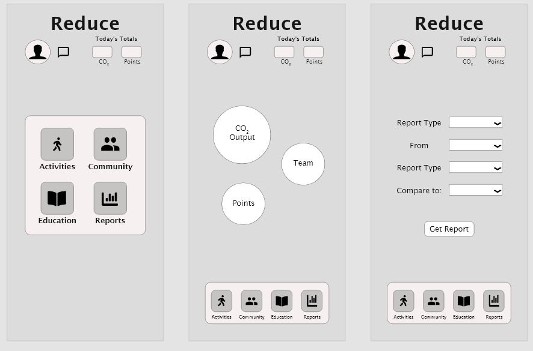
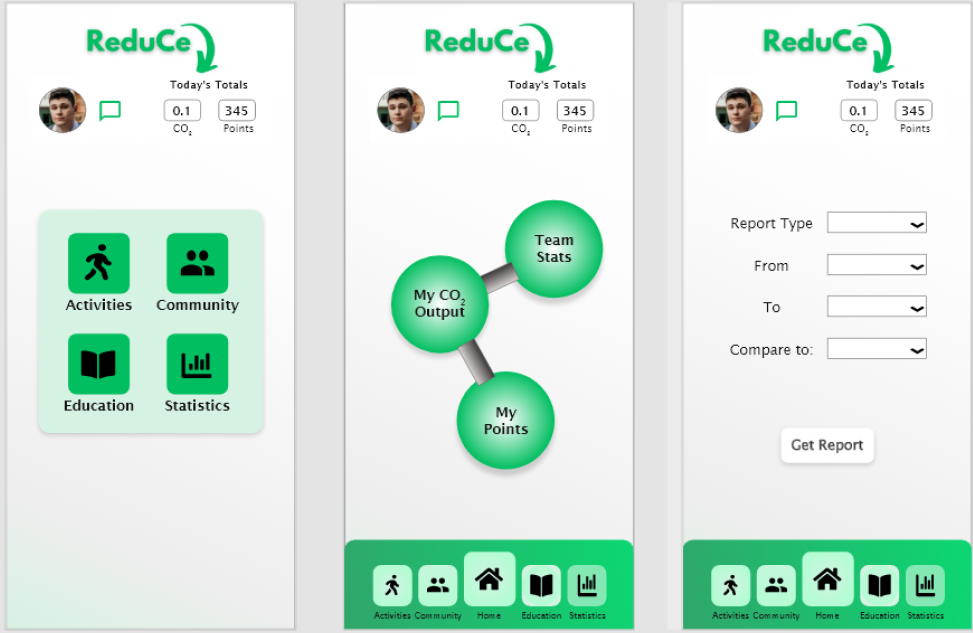

## Reduce
ReduCe is intended to help users make a positive impact on the environment by providing them with information that reduces their carbon footprint. It does this by calculating the user's daily carbon-dioxide output based on their daily tasks.
Apart from providing the user with alternatives to their daily routing that will output less carbon-dioxide, ReduCe also reports users daily, weekly and monthly output so they can monitor their output over time.

### Empathize
 *Empathy map, environmentally conscious user*
 

### Define

 *User persona*
 

### Ideate
!!!! Remember all ideas, even those that seem impractical are good ideas.

 *A mindmap showing ways the user could reduce their carbon dioxide output*

 

### Prototype
 *High-fidelity wireframe*

 

### Test
 *Reduce App Mockup*
 

